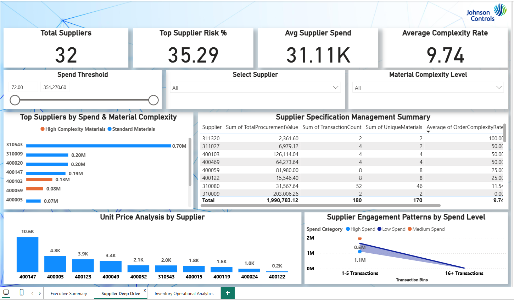

# Supply Chain Management Analytics - Johnson Controls Arabia

## 📊 Project Overview
Comprehensive supply chain analytics project for Johnson Controls Arabia's procurement and inventory management department. This end-to-end analysis transformed raw SAP data into actionable executive insights through SQL data modeling, advanced analytics, and interactive Power BI dashboards.

## 🎯 Business Problem
Johnson Controls Arabia needed visibility into their procurement operations, supplier performance, and inventory movements to:
- Identify cost optimization opportunities
- Assess supplier concentration risks
- Monitor procurement process accuracy
- Optimize inventory management strategies

## 🛠️ Tech Stack
- **SQL** - Data extraction, transformation, and view creation from SAP tables
- **Power BI** - Interactive dashboard development with 25+ calculated KPIs
- **DAX** - Advanced measures and KPI calculations
- **Excel** - Data cleaning and intermediate processing
- **PowerPoint** - Executive presentation and insights communication
- **SAP ERP** - Source system (EKKO, EKPO, MSEG tables)

## 📁 Project Structure
```
├── data/
│   ├── raw_data.XLSX                    # Original unprocessed SAP data
│   └── cleaned_data.xlsx                # Processed data from SQL views
├── sql/
│   └── JCAQuery.sql                     # SQL views and business logic queries
├── reports/
│   ├── Inventory_Data_Analysis_Report.pdf          # Comprehensive 15-page analysis
│   └── Inventory_Data_Analysis_Presentation.pptx   # Executive summary deck
├── dashboard/
│   └── Inventory_Data_Analysis_Dashboard.pbix      # Interactive Power BI dashboard
└── screenshots/
    ├── executive_summary.PNG            # Dashboard overview
    ├── supplier_deep_drive.PNG          # Supplier performance analysis
    └── inventory_operational_analytics.PNG  # Inventory operations view
```

## 🔄 Project Workflow

### 1. Data Extraction & Transformation (SQL)
- Imported raw SAP data into SQL database
- Created 4 comprehensive SQL views:
  - **Procurement Performance Analysis** - Transaction-level procurement metrics
  - **Supplier Performance Dashboard** - Aggregated supplier KPIs
  - **Material Category Analysis** - Category-wise spend patterns
  - **Inventory Movement Analysis** - Complete operational visibility across 13 movement types

### 2. Data Analysis & Insights (SQL + Excel)
- Executed business intelligence queries on SQL views
- Analyzed 2,000+ inventory transactions and 90 procurement transactions
- Identified critical insights on supplier concentration, process accuracy, and spending patterns
- Documented findings in comprehensive 15-page analytical report

### 3. Visualization & Reporting (Power BI + PowerPoint)
- Imported cleaned data into Power BI
- Developed interactive dashboard with 25+ DAX-calculated KPIs
- Created executive presentation summarizing key findings
- Designed three main dashboard views for different analytical perspectives

## 📈 Key Analytical Views

### Executive Summary Dashboard

High-level KPIs including total spend, supplier count, procurement efficiency metrics, and trend analysis.

### Supplier Deep Dive Analysis

Detailed supplier performance metrics, concentration risk assessment, and specification complexity indicators.

### Inventory Operational Analytics

Comprehensive view of inventory movements, material flow patterns, and operational efficiency metrics.

## 💡 Key Business Insights

### Critical Findings
- **Supplier Concentration Risk**: Top supplier controls 35.3% of total spend ($351,270.60)
- **Material-Level Risk**: Single material represents 31.9% of procurement budget ($317,168.28)
- **Process Accuracy**: 10% order correction rate indicating specification challenges
- **Seasonal Patterns**: 74.9% of annual spend concentrated in February
- **Category Dominance**: Material Group 300YM accounts for 52.7% of spend

### Operational Metrics
- **Total Procurement**: $995,391.56 across 90 transactions
- **Average Transaction Value**: $12,655 per procurement vs. $370 per consumption
- **Material Complexity**: 459 materials in consumption vs. 87 in procurement
- **Quality Operations**: 89 inspection movements across 85 materials
- **Transfer Activities**: 818 movements indicating active inventory management

## 📊 Technical Achievements
- Processed 13 different SAP movement types (101, 102, 261, 262, 301, 309, 311, 312, 321, 411, 412, 601, 641)
- Created reusable SQL views for ongoing analysis
- Developed 25+ DAX measures for dynamic KPI calculations
- Integrated multiple SAP tables (EKKO, EKPO, MSEG) into unified analytical model
- Designed executive-ready visualizations for C-suite decision-making

## 🎓 Skills Demonstrated
- Advanced SQL query design and database view creation
- DAX formula development for complex business metrics
- Power BI dashboard design and data modeling
- Business intelligence and procurement analytics
- Executive communication and insight presentation
- End-to-end data analytics project delivery

## 👨‍💼 About
**Emaad Ur Rehman**  
Data Analyst | Publicis Groupe  
Specializing in paid media analytics, business intelligence, and data-driven decision support

---

*This project demonstrates comprehensive data analytics capabilities including data extraction, SQL-based transformation, advanced analysis, and executive-level visualization - delivering actionable insights for strategic procurement decisions.*

---
